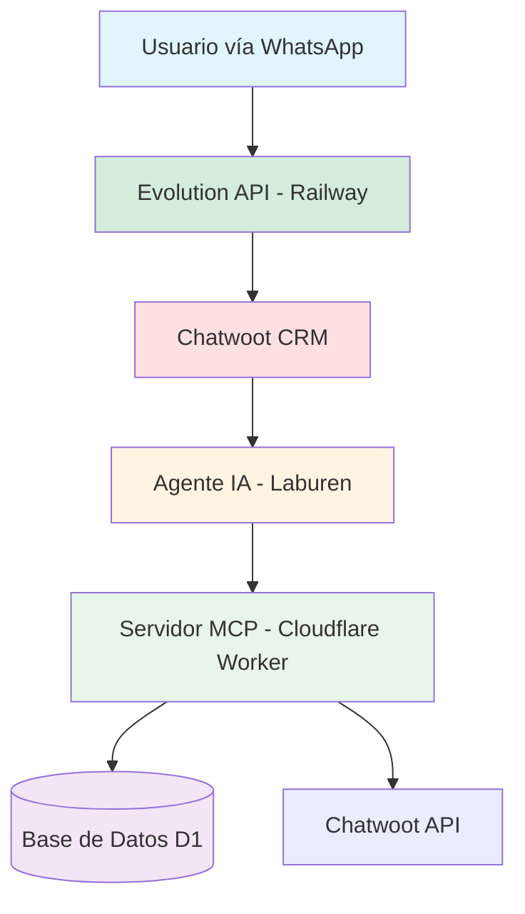
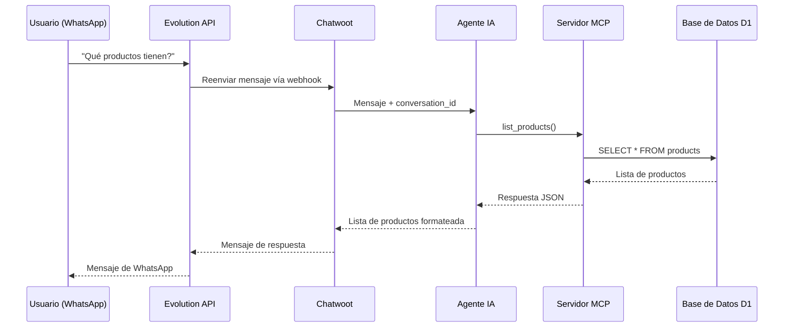
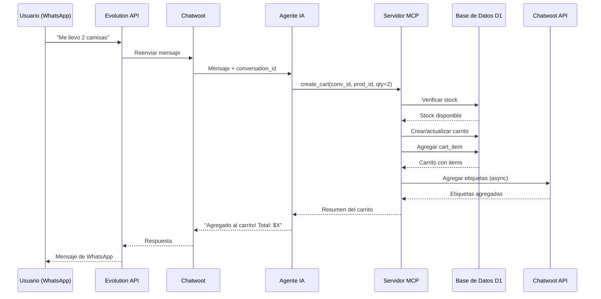
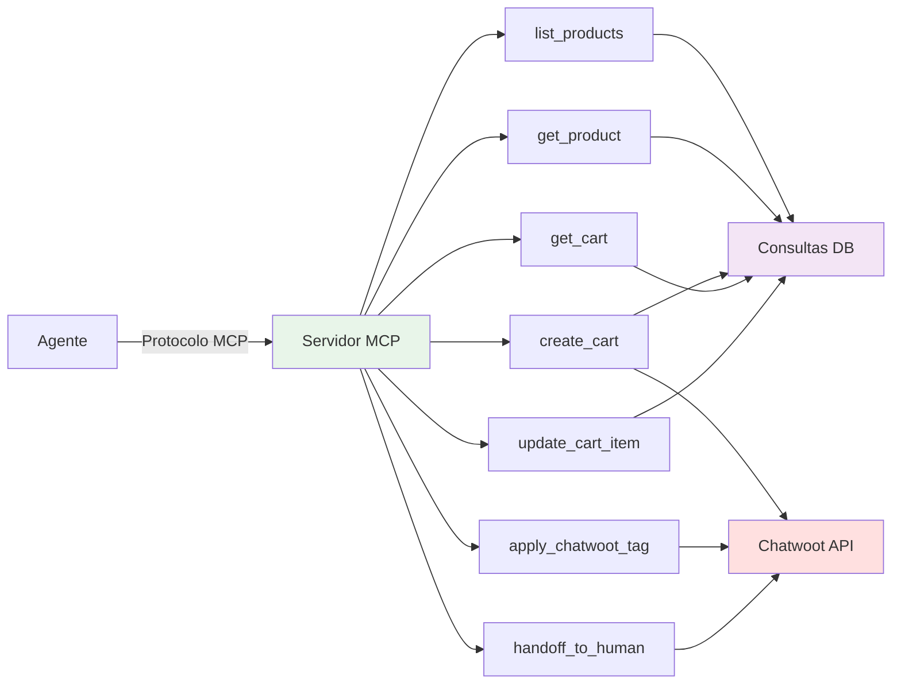
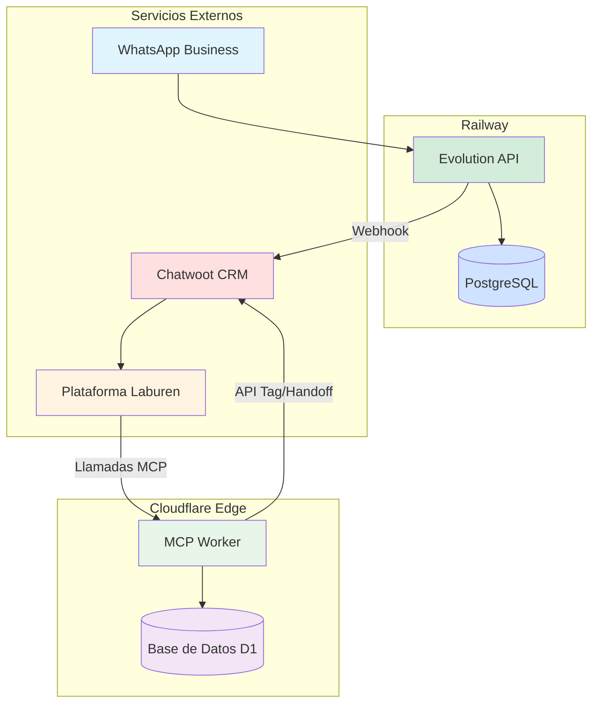

# Arquitectura del Sistema

## Vista General

## Detalles de Componentes

### WhatsApp
- Canal de comunicación principal para usuarios finales
- Los mensajes se envían/reciben a través de WhatsApp Business API
- Integrado vía Evolution API

### Evolution API (Railway)
- API de WhatsApp Web de código abierto
- Desplegada en Railway.app
- Maneja la conexión con WhatsApp y enrutamiento de mensajes
- Reenvía mensajes a Chatwoot vía webhook
- Gestiona la autenticación por código QR para WhatsApp

### Chatwoot CRM
- Recibe mensajes desde Evolution API
- Gestiona el estado e historial de conversaciones
- Proporciona conversation_id para seguimiento de carritos
- Recibe etiquetas automatizadas desde el Servidor MCP
- Permite derivación a agentes humanos cuando sea necesario

### Agente IA (Laburen)
- Modelo Claude 3.5 Sonnet alojado en Laburen.com
- Procesa mensajes de usuarios desde Chatwoot
- Llama a herramientas MCP para operaciones de datos
- Formatea respuestas para usuarios
- Maneja el flujo de ventas conversacional

### Servidor MCP (Cloudflare Worker)
- Expone 7 herramientas vía protocolo MCP
- Maneja la lógica de negocio
- Gestiona operaciones de base de datos
- Se integra con Chatwoot API para etiquetado y derivación

### Base de Datos D1
- Base de datos SQLite en Cloudflare
- Almacena productos, carritos y cart_items
- Gestión automática de timestamps vía triggers

## Flujo de Datos

### Flujo de Búsqueda de Productos

### Flujo de Agregar al Carrito

## Esquema de Base de Datos

## Arquitectura de Herramientas MCP

## Arquitectura de Despliegue

## Consideraciones de Seguridad

### Autenticación
- Token de API de Chatwoot almacenado como secreto de Cloudflare
- El endpoint MCP puede protegerse con API key si es necesario
- Base de datos D1 solo accesible desde el Worker

### Privacidad de Datos
- IDs de conversación usados para aislamiento de carritos
- No se almacena PII en la base de datos
- Los datos del carrito pueden purgarse periódicamente

### Limitación de Tasa
- Cloudflare Workers tienen protección DDoS integrada
- Las llamadas a la API de Chatwoot incluyen lógica de reintento con backoff
- Consultas de base de datos optimizadas con índices

## Escalabilidad

### Límites Actuales
- Cloudflare Workers: 50ms de tiempo de CPU por solicitud
- Base de Datos D1: 100k lecturas/día (tier gratuito)
- Herramientas MCP diseñadas para tiempo de respuesta sub-100ms

### Estrategias de Optimización
- Índices de base de datos en columnas consultadas frecuentemente
- Etiquetado asíncrono de Chatwoot (no bloqueante)
- Consultas SQL eficientes con JOINs
- Transferencia mínima de datos en respuestas

## Monitoreo

### Métricas Disponibles
- Cloudflare Analytics: conteo de solicitudes, errores, latencia
- Logs del Worker: `wrangler tail` para debugging en tiempo real
- Rendimiento de consultas D1 vía dashboard de Cloudflare

### Manejo de Errores
- Todas las herramientas retornan respuestas de error estructuradas
- Fallos de Chatwoot se registran pero no bloquean operaciones
- Errores de base de datos se capturan y retornan al agente
