# System Architecture

## Overview

## Component Details

### WhatsApp + Chatwoot
- Entry point for user interactions
- Manages conversation state
- Provides conversation_id for cart tracking
- Receives automated tags from MCP Server

### AI Agent (Laburen)
- Claude 3.5 Sonnet model
- Processes user messages
- Calls MCP tools for data operations
- Formats responses for users

### MCP Server (Cloudflare Worker)
- Exposes 5 tools via MCP protocol
- Handles business logic
- Manages database operations
- Integrates with Chatwoot API for tagging

### D1 Database
- SQLite database on Cloudflare
- Stores products, carts, and cart_items
- Automatic timestamp management via triggers

## Data Flow

### Product Search Flow

```mermaid
sequenceDiagram
    participant U as User
    participant A as Agent
    participant M as MCP Server
    participant D as D1 Database
    
    U->>A: "Qué productos tienen?"
    A->>M: list_products()
    M->>D: SELECT * FROM products
    D-->>M: Product list
    M-->>A: JSON response
    A-->>U: Formatted product list
```

### Add to Cart Flow

## Database Schema

## MCP Tools Architecture

## Deployment Architecture

## Security Considerations

### Authentication
- Chatwoot API token stored as Cloudflare secret
- MCP endpoint can be protected with API key if needed
- D1 database only accessible from Worker

### Data Privacy
- Conversation IDs used for cart isolation
- No PII stored in database
- Cart data can be purged periodically

### Rate Limiting
- Cloudflare Workers have built-in DDoS protection
- Chatwoot API calls include retry logic with backoff
- Database queries optimized with indexes

## Scalability

### Current Limits
- Cloudflare Workers: 50ms CPU time per request
- D1 Database: 100k reads/day (free tier)
- MCP tools designed for sub-100ms response time

### Optimization Strategies
- Database indexes on frequently queried columns
- Async Chatwoot tagging (non-blocking)
- Efficient SQL queries with JOINs
- Minimal data transfer in responses

## Monitoring

### Available Metrics
- Cloudflare Analytics: request count, errors, latency
- Worker logs: `wrangler tail` for real-time debugging
- D1 query performance via Cloudflare dashboard

### Error Handling
- All tools return structured error responses
- Chatwoot failures logged but don't block operations
- Database errors caught and returned to agent
